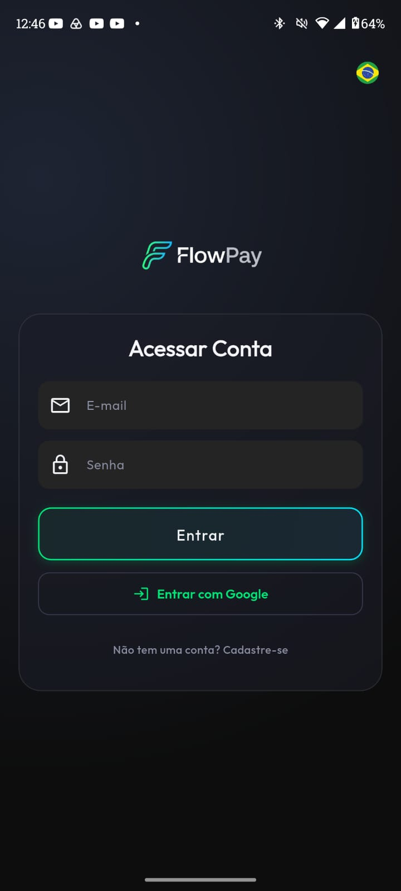
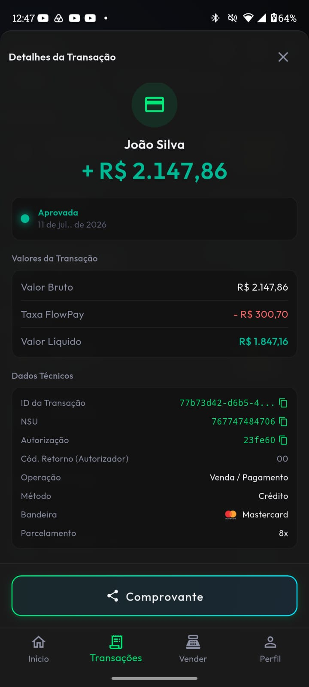
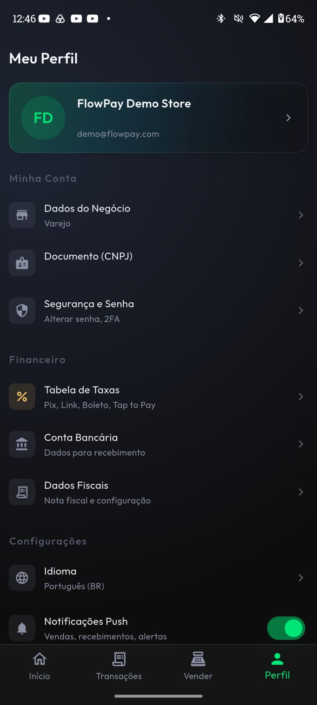

# FlowPay

O FlowPay é um aplicativo de portfólio desenvolvido em Flutter, criado para demonstrar a aplicação de padrões de engenharia de software no contexto de meios de pagamento e fintechs.

> **Status: Em Desenvolvimento (WIP)**
> A fundação arquitetural, o design system e os módulos principais estão implementados. Funcionalidades secundárias, como dados cadastrais e o simulador de vendas, estão sendo adicionadas conforme o roadmap.
> 
> *Nota: O app foi criado e validado em um emulador Pixel 8 (Android 16). Como o projeto ainda está em andamento, alguns ajustes de layout para telas menores podem estar pendentes.*

O projeto simula o painel (dashboard) de um lojista (merchant), utilizando uma arquitetura baseada em Clean Architecture e comunicação com backend real.

---

## 📱 Screenshots

| Login | Dashboard | Extrato |
|:-----:|:---------:|:-------:|
|  |  |  |
| **Detalhes da Transação** | **Vendas** | **Perfil** |
|  |  |  |

---

## Funcionalidades e Status Atual

### ✅ Implementado
- **Autenticação:** Login, integração com Google OAuth e modo Demo.
- **Dashboard Financeiro:** Exibição de saldo calculado no backend, gráfico interativo de linha e atalhos rápidos.
- **Transações (Extrato):** Lista agrupada por datas, detalhamento em modal e exibição do status da transação (aprovada, falha, chargeback, reembolso).
- **Filtros:** Filtro por tipo de transação, período e status.
- **Internacionalização (i18n):** Suporte nativo aos idiomas Português, Inglês e Espanhol.
- **Relatórios:** Geração de relatórios transacionais em PDF via Supabase Edge Functions.
- **UI/UX:** Componentes padronizados, animações nativas e suporte a Haptics.

### 🚧 Em Desenvolvimento (Roadmap)
- **Hub de Vendas:** Simulador de geração de links de pagamento, Pix Copia e Cola e Tap-to-Pay.
- **Perfil do Lojista (CRUD):** Edição de dados do negócio, upload de documentos e gestão de domicílio bancário.
- **Segurança:** Configuração de 2FA e autenticação biométrica (`local_auth`).
- **Agenda de Recebíveis:** Visualização de repasses futuros.

*(Telas e botões não implementados exibem um aviso provisório de "Em breve").*

---

## Estrutura e Arquitetura

O projeto utiliza os princípios de **Clean Architecture**, dividindo responsabilidades em camadas para garantir independência de frameworks.

- **Feature-First:** Código organizado por módulos (`auth`, `dashboard`, `transactions`, `charges`, `profile`).
- **Domain Layer:** Contém Entidades, Interfaces de Repositório e *Use Cases*.
- **Data Layer:** Implementação de repositórios integrados ao Supabase via injeção de dependências (`get_it`).
- **Presentation Layer:** Gerenciamento de estado utilizando o padrão **BLoC** (`flutter_bloc`).
- **Tratamento de Erros:** Utilização de programação funcional com `Either` (pacote `dartz`) para envelopar retornos e facilitar o tratamento de falhas.

---

## Tecnologias Utilizadas
- **Flutter & Dart**
- **Supabase** (PostgreSQL, Edge Functions, Auth e Storage com RLS)
- **flutter_bloc** (Gerenciamento de Estado)
- **get_it** (Injeção de Dependências)
- **go_router** (Navegação Declarativa com *Stateful Shell Route*)
- **fl_chart** (Gráficos)
- **flutter_localizations** (i18n)

> *Nota de Refatoração (Issue #5):* O pacote `freezed` será adotado nas operações e modelos de dados para garantir imutabilidade e simplificar a manipulação de estados complexos através de *sealed classes*.

---

## Teste Rápido (Modo Demo)

Para testar o aplicativo sem necessidade de criar uma conta:

1. Inicie o aplicativo.
2. Na tela de login, toque 3 vezes consecutivas no logo do FlowPay.
3. O login será feito com credenciais de teste, carregando transações fictícias pré-geradas no banco de dados (`seed_demo.sql`).
